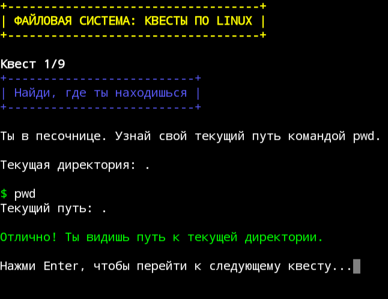
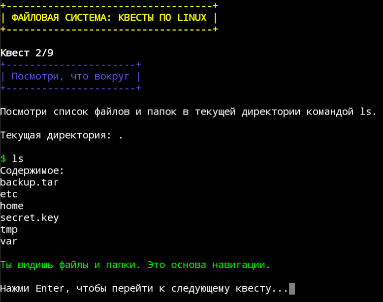
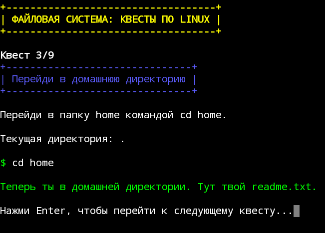
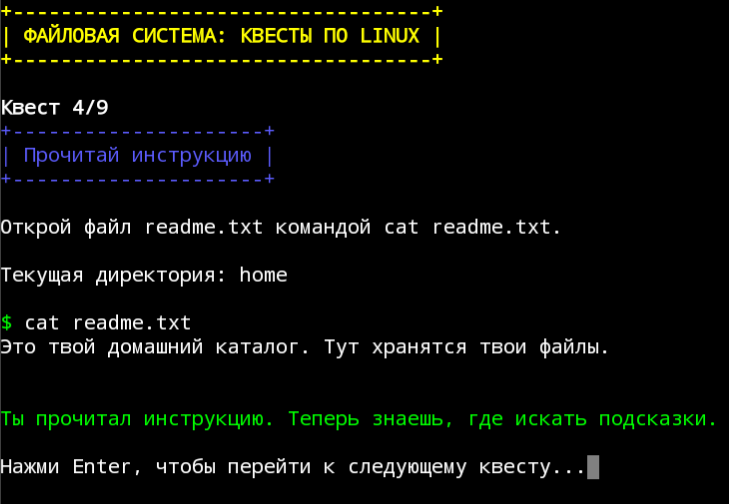
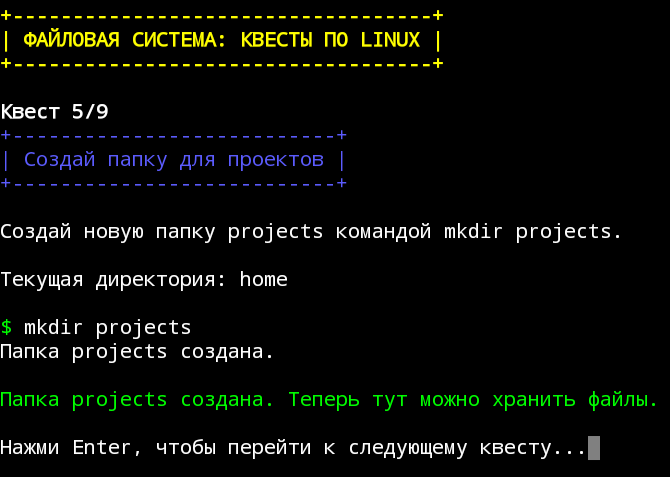
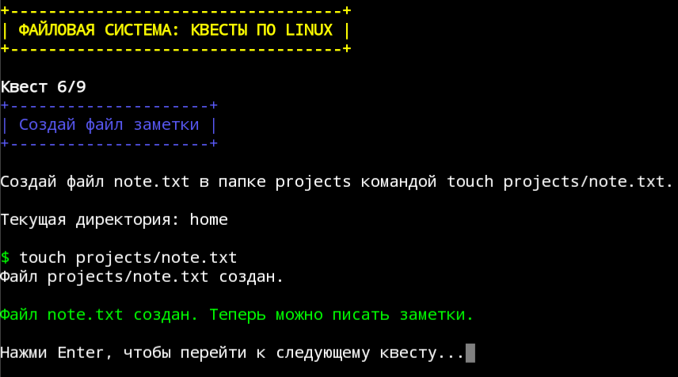
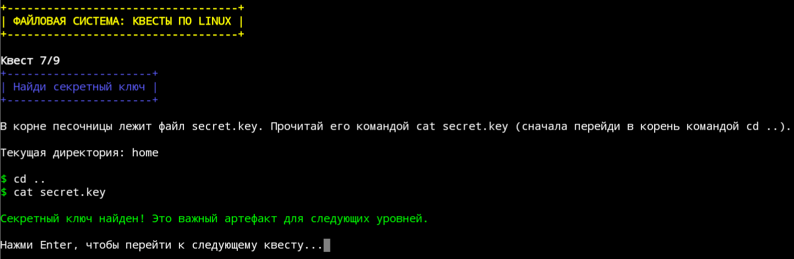
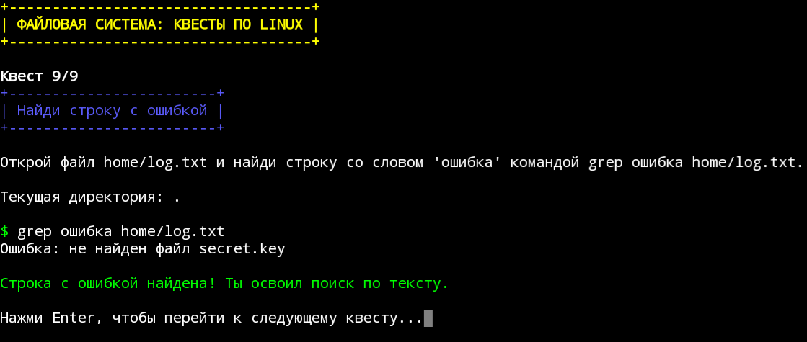
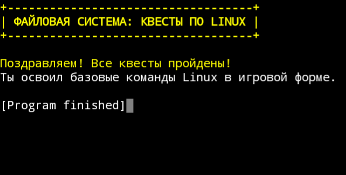

# Filer Quest

> Navigate, hack, fix – master Linux commands through filesystem quests.

## 💻 Project Run
- Open with Python: [FilerQuest.py](FilerQuest.py)
  
- Or download exe: [FilerQuest.exe](https://github.com/NebulaStack-prog/Calculator-v.1/releases/tag/v1.0)

## 📄 Full Documentation
- 🇷🇺  Russian version: [Documentation](FQ_RU.md)
  
- 🇺🇲  English version: [Documentation](FQ_EN.md)
  
## 📷 Screenshots

© NESTIMS
